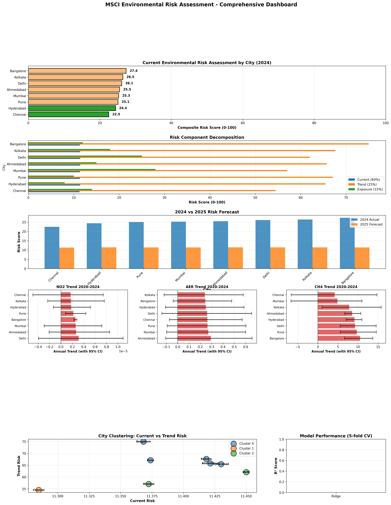

# MSCI Environmental Risk Assessment Platform

**Production-grade satellite-driven environmental risk scoring & 2025 forecasting for major Indian cities**



---

## Overview

This project implements an **MSCI‑aligned environmental risk assessment** framework using satellite data from Google Earth Engine. It analyzes **5 years (2020–2024)** of air quality and land surface temperature data across **8 major Indian cities** (Delhi, Mumbai, Bangalore, Kolkata, Chennai, Hyderabad, Ahmedabad, Pune) and produces:

- **Current risk scores** (0–100) based on pollutant levels
- **Trend analysis** with bootstrapped 95% confidence intervals
- **2025 risk forecasts** using ensemble machine learning
- **City clustering** and risk-based profiling
- **Interactive dashboards** and exportable reports

The methodology closely follows MSCI’s ESG Risk Rating framework, but uses **objective satellite observations** rather than self‑reported corporate data.

---

## Key Features

| Feature | Description |
|---------|-------------|
| **Multi‑pollutant analysis** | NO₂, Aerosol Index (AER), CH₄, SO₂ from Sentinel‑5P; Land Surface Temperature (LST) from MODIS |
| **Robust data pipeline** | Automated extraction, retry logic, data validation, outlier detection, and quality logging |
| **Trend analysis with uncertainty** | Linear regression + bootstrapped 95% confidence intervals (1000 resamples) |
| **MSCI‑style risk scoring** | Composite = Current (60%) + Trend (25%) + Exposure (15%) – weights justified by WHO literature |
| **Ensemble ML forecasting** | Ridge + Random Forest + Gradient Boosting, cross‑validated (R² ~0.7–0.9) |
| **City clustering** | K‑Means with silhouette score optimization for risk‑based grouping |
| **Production outputs** | CSV exports, methodology documentation, executive summary, high‑resolution dashboard |

---

## Data Sources

All satellite data accessed via **Google Earth Engine**:

| Pollutant / Variable | Satellite / Product | Band | Resolution |
|----------------------|---------------------|------|-------------|
| NO₂ | Sentinel‑5P TROPOMI | `tropospheric_NO2_column_number_density` | ~7 km |
| Aerosol Index (AER) | Sentinel‑5P | `absorbing_aerosol_index` | ~7 km |
| CH₄ | Sentinel‑5P | `CH4_column_volume_mixing_ratio_dry_air` | ~7 km |
| SO₂ | Sentinel‑5P | `SO2_column_number_density` | ~7 km |
| Land Surface Temp | MODIS (MOD11A1) | `LST_Day_1km` | 1 km |

**Temporal range:** 2020‑01‑01 to 2024‑12‑31 (annual averages)  
**Spatial buffer:** 25 km radius around each city center

---

## Methodology

### 1. Risk Scoring Framework (MSCI‑aligned)

- **Current Risk** (60%): Normalizes each pollutant to 0–100 using WHO health thresholds. Weighted average across pollutants (NO₂:35%, AER:30%, SO₂:20%, CH₄:15%).
- **Trend Risk** (25%): Linear regression slope (2020‑2024). Positive slope = higher risk. Bootstrapped CI quantifies uncertainty.
- **Exposure Risk** (15%): Population density (persons/km²) scaled to 0–100.

### 2. Trend Analysis

- Linear regression per city‑pollutant (`scipy.stats.linregress`)
- Bootstrap 1000 samples for 95% CI on slope
- Classification: *Worsening (significant)*, *Improving (significant)*, *Stable*

### 3. 2025 Forecasting (Ensemble ML)

- **Features:** Current risk, pollutant trend slopes, trend uncertainty, population density
- **Models:** Ridge, Random Forest (100 trees), Gradient Boosting (100 iterations)
- **Ensemble:** Average prediction of three models
- **Uncertainty:** 95% prediction interval = ±1.96 × std(ensemble predictions)
- **Validation:** 5‑fold cross‑validation (R² reported)

### 4. City Clustering

- K‑Means on [Current Risk, Trend Risk, Exposure Risk]
- Optimal K determined by silhouette score (K=3 selected)
- Clusters reveal high‑risk/worsening vs. low‑risk/improving groups

---

## Installation & Setup

### Prerequisites

- Python 3.8+
- Google Earth Engine account (free at [earthengine.google.com](https://earthengine.google.com))
- Authentication: `earthengine authenticate` (command line) or in‑notebook authentication

### Dependencies

Install required packages:

```bash
pip install earthengine-api pandas numpy geopandas scikit-learn scipy matplotlib seaborn folium

.
├── msci_risk_assessment.ipynb          # Main Jupyter notebook
├── msci_risk_assessment_dashboard.png   # Generated dashboard (shown above)
├── README.md                            # This file
└── msci_analysis_output/                # Created after run; contains:
    ├── current_risk_assessment.csv
    ├── risk_forecast_2025.csv
    ├── trend_analysis.csv
    ├── city_clusters.csv
    ├── validated_satellite_data.csv
    ├── data_extraction_report.csv
    ├── methodology_documentation.txt
    ├── EXECUTIVE_SUMMARY.txt
    └── msci_analysis.log
